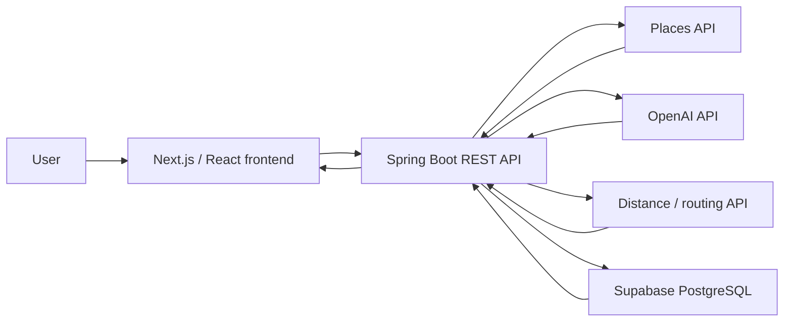

# SideQuest

> Spend less time searching. More time experiencing.

SideQuest turns a user's free time into a personalized, real-world adventure. Based on their location, budget, available time, group, vibe, and travel method, the app creates an itinerary of real local places, guides them through each stop, and rewards completion with a collectible digital passport stamp.

Built as a 24-hour hackathon project, SideQuest begins in Fredericton, New Brunswick, and is designed to expand to other cities.

## The problem

People often feel that there is not much to do nearby. The experiences exist, but finding activities that match a budget and schedule - then combining them into a complete outing - takes time and effort.

SideQuest does that research for the user. It turns a few preferences into a ready-to-follow local adventure.

## Demo flow

**Preferences -> AI adventure -> Real stops -> Check-in -> Passport stamp -> Saved adventure**

1. Enter a location, budget, available time, group, vibe, and travel mode.
2. Retrieve suitable real-world locations from a Places API.
3. Generate a personalized adventure containing 2-4 stops.
4. Display the route and travel time between stops on a map.
5. Check in at each stop using GPS or the demo fallback.
6. Complete the adventure and earn a digital passport stamp.
7. Save completed adventures and stamps in the Adventure Passport.

## Core features

- Personalized adventures based on six user preferences
- Real local stops rather than invented destinations
- Map, route, and estimated travel time
- Stop-by-stop progress and check-in flow
- Collectible digital passport stamps
- A gallery of completed adventures and earned stamps
- Simulated check-in fallback for a reliable live demo

## Architecture



The backend retrieves candidate places, combines them with the user's preferences, and asks the AI service to build a coherent adventure. It also calculates route information and saves completed adventures, stops, and stamps in Supabase.

## Tech stack

| Area | Technology |
| --- | --- |
| Frontend | React / Next.js |
| Backend | Java / Spring Boot |
| AI | OpenAI API |
| Database | Supabase (PostgreSQL) |
| Places | Google Places API or OpenTripMap |
| Maps | Mapbox or Google Maps |
| Distance and routing | OpenRouteService or Google Distance Matrix |
| Deployment | Vercel |
| Design and collaboration | Figma and GitHub |

## Repository structure

```text
SideQuest/
├── frontend/    # Next.js / React application
├── backend/     # Spring Boot REST API
├── docs/        # API contract, mock data, and architecture notes
└── README.md    # Project overview and setup guide
```

## Getting started

### Prerequisites

- Node.js and npm
- Java 17 or newer
- A Supabase project
- Credentials for the external services selected by the team

### 1. Clone the repository

```bash
git clone https://github.com/DEVELOPING100/SideQuest.git
cd SideQuest
```

### 2. Configure environment variables

Create a local `.env` file and provide the credentials used by your setup:

```dotenv
OPENAI_API_KEY=
PLACES_API_KEY=
DISTANCE_API_KEY=
SUPABASE_URL=
SUPABASE_KEY=
```

Never commit real credentials. Keep `.env` in `.gitignore` and share secrets through a secure channel.

### 3. Start the backend

From the repository root:

```bash
cd backend
./mvnw spring-boot:run
```

### 4. Start the frontend

In a second terminal:

```bash
cd frontend
npm install
npm run dev
```

Open the local URL shown by Next.js. The exact API and frontend ports can be changed in each application's configuration.

> The commands above assume the backend uses the Maven wrapper. If the finalized Spring Boot scaffold uses Gradle, run `./gradlew bootRun` instead.

## Team

| Team member | Area | Responsibilities |
| --- | --- | --- |
| Aljaberi | Frontend - input and adventure | Preference form, generated-adventure screen, stop list, map, and backend connection |
| Sotonte | Frontend - check-in and passport | Check-in flow, stamp component, Adventure Passport, and completion states |
| David | Backend - AI and generation | Spring Boot API, Places integration, OpenAI integration, and generated itineraries |
| Parfait | Data, distance, and integration | Supabase schema and connection, saved adventures and stamps, routing API, and final integration |

## Git workflow

- Keep `main` stable and demo-ready.
- Work on the assigned feature branch; do not experiment directly on `main`.
- Make small, clear commits and push them regularly.
- Open a pull request when a feature works.
- Have at least one teammate review each pull request.
- Merge feature work into `frontend` or `backend`, then merge tested integration checkpoints into `main`.

Planned feature branches:

```text
frontend/adventure-screen       # Aljaberi
frontend/passport-checkin       # Sotonte
backend/ai-generation           # David
backend/supabase-distance       # Parfait
```

## Stretch goals

- Social passports with sharing, comments, and comparisons
- Richer animations and stamp designs
- Improved live GPS check-in
- A more detailed interactive map
- Support for additional cities

## Hackathon principle

**A complete core experience beats a collection of unfinished features.** The target is a dependable path from preferences to a saved passport stamp, with optional improvements added only after that flow works end to end.
