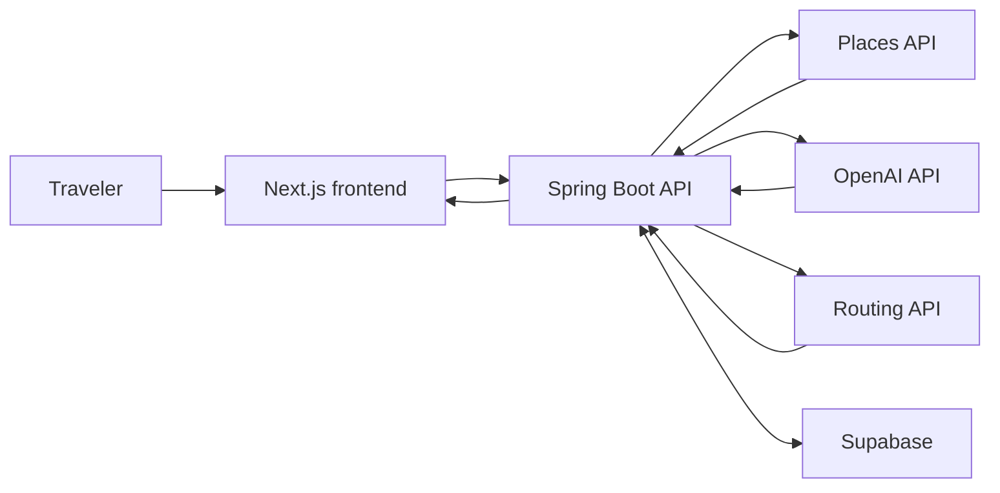

<div align="center">

# 🧭 SideQuest

### Spend less time searching. More time experiencing.

SideQuest turns a few preferences into a personalized, real-world adventure through local places.


</div>

---

## Why SideQuest?

People often say there is not much to do nearby. In reality, finding activities that fit a budget, schedule, group, mood, and travel method is the hard part.

SideQuest handles that research. It finds real local places, builds them into one practical itinerary, guides the user through each stop, and saves the finished adventure as a digital passport stamp.

> **MVP:** Preferences → Real places → AI itinerary → Route → Check-in → Stamp → Saved passport

## The experience

| Step | What happens |
| --- | --- |
| **1. Personalize** | Choose a location, budget, available time, group, vibe, and travel mode. |
| **2. Generate** | SideQuest creates a 2-4 stop adventure using real local places. |
| **3. Explore** | Follow the mapped route and check in at each destination. |
| **4. Collect** | Complete the adventure and add a new stamp to the Adventure Passport. |

### Core features

- Personalized adventures built around six user preferences
- Real destinations supplied by a Places API
- Route maps and travel-time estimates
- GPS check-in with a reliable demo fallback
- Progress tracking for completed and remaining stops
- Collectible stamps and a saved Adventure Passport

## How it works



The backend retrieves suitable places, combines them with the user's preferences, and uses AI to assemble a coherent adventure. Supabase stores adventures, stops, completion progress, and earned stamps.

## Tech stack

| Layer | Technology |
| --- | --- |
| Web app | React, Next.js |
| API | Java, Spring Boot |
| AI | OpenAI API |
| Data | Supabase, PostgreSQL |
| Places | Google Places API or OpenTripMap |
| Maps | Mapbox or Google Maps |
| Routing | OpenRouteService or Google Distance Matrix |
| Deployment | Vercel |

## Quick start

### Prerequisites

- Node.js and npm
- Java 17+
- A Supabase project
- Credentials for the selected AI, places, maps, and routing services

### 1. Clone the project

```bash
git clone https://github.com/DEVELOPING100/SideQuest.git
cd SideQuest
```

### 2. Add local environment variables

Create a `.env` file. Never commit real credentials.

```dotenv
OPENAI_API_KEY=
PLACES_API_KEY=
DISTANCE_API_KEY=
SUPABASE_URL=
SUPABASE_KEY=
```

### 3. Run the backend

```bash
cd backend
./mvnw spring-boot:run
```

If the finalized Spring Boot scaffold uses Gradle, run `./gradlew bootRun` instead.

### 4. Run the frontend

In another terminal:

```bash
cd frontend
npm install
npm run dev
```

Open the local URL printed by Next.js.

## Project guide

| Resource | Purpose |
| --- | --- |
| [`frontend/`](./frontend/README.md) | Frontend setup, screens, components, and mock-data workflow |
| [`backend/`](./backend/README.md) | Backend setup, endpoints, services, and starter schema |
| [`docs/api-contract.md`](./docs/api-contract.md) | Shared request and response contract |
| [`docs/mock-data.json`](./docs/mock-data.json) | Sample data for parallel frontend development |

## Team

| Team member | Ownership |
| --- | --- |
| **Aljaberi** | Preference input, generated-adventure screen, stop list, map, and frontend integration |
| **Sotonte** | Check-in flow, stamp component, completion states, and Adventure Passport |
| **David** | Spring Boot API, Places integration, OpenAI integration, and adventure generation |
| **Parfait** | Supabase, saved adventures and stamps, routing, and final integration |

## Working together

- Keep `main` stable and ready to demo.
- Work on an assigned feature branch and make small, clear commits.
- Open a pull request once a feature works.
- Have at least one teammate review each pull request.
- Update the API contract and mock data together whenever a response shape changes.

```text
frontend/adventure-screen       # Aljaberi
frontend/passport-checkin       # Sotonte
backend/ai-generation           # David
backend/supabase-distance       # Parfait
```

## Stretch goals

- Social passports with sharing, comments, and comparisons
- Richer animations and custom stamp designs
- Improved live GPS check-in and map interactions
- Adventures in additional cities

---

<div align="center">

**Core working experience first. Extra features second.**

</div>
